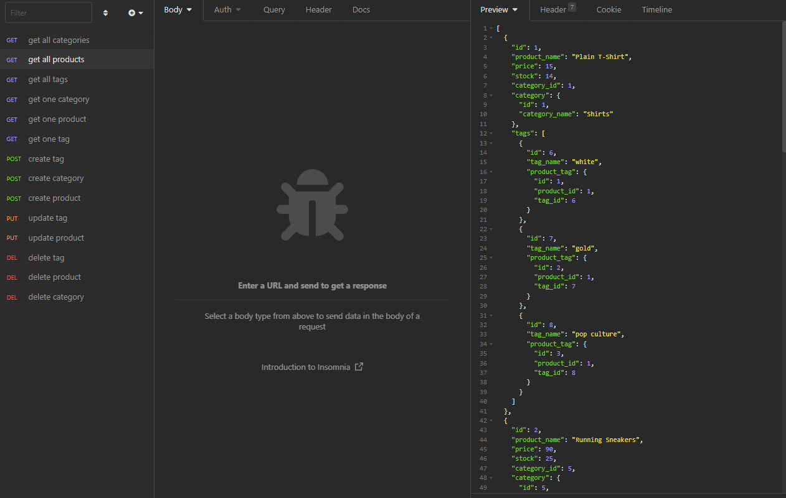

# onlineRetail
An online e-commerce back end using Express.js API, Sequelize, and MySQL.

## Developer Info  
- Developed by Karl Linfeldt  
- [Github Repo](https://github.com/KarlOL82/onlineRetail)  
- [email](klinfeldt@gmail.com)  

## User Story  
AS A manager at an internet retail company
I WANT a back end for my e-commerce website that uses the latest technologies
SO THAT my company can compete with other e-commerce companies.  

## Overview  
This application runs in Node Js with Express, Sequelize, and MySQL. This is back end code only so there is no live deployment. The application features models for Categories, Tags, and Products with API routes to Create, Read, Update, and delete for each.  

## Installing and Running the App  
To run this application, you will need to clone it locally from the Github repository link above. Once you have it cloned down, navigate to the db folder and open your MySQL shell to run the schema. Then, navigate back to the root directory and execute the 'npm run seed' command to seed the data and then 'node server.js' to open the server.  

## License
    
  https://opensource.org/licenses/MIT  

  This application is using the MIT license.  

## Walkthrough video and Screenshot  

[Video Walkthrough Demo](https://www.youtube.com/watch?v=bIir7O3jggM)  

  

## Dependencies  
- Express 4.17.1  
- MySQL2 2.1.0  
- Sequelize 5.21.7  
- dotenv 8.2.0

